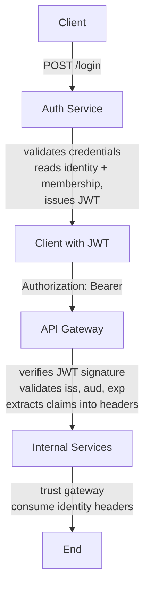

Auth Service

# Auth Service 

registers new users, validates user credentials, issues short-lived JWT access tokens, acts as the single source of truth for identity.

Authorization is delegated to the API Gateway and downstream services.

## Responsibilities

- exposes HTTP endpoints for User registration and login

- verifies credentials

- issues RS256-signed JWT access tokens

#### The service does not

- authorize business actions

- parse JWTs after issuing them

- manage sessions

- expose internal user data

## Architecture Overview


  

#### API Gateway
  - verifies JWT signature
  - validates iss / aud / exp
  - extracts claims into headers
  |
  v
#### Internal Services
  - trust gateway
  - consume identity headers

This design follows a zero-trust gateway model:

- JWT verification happens once, at the gateway

- Internal services never parse or verify JWTs

## Authentication Flow
### Login

- Client sends credentials to POST /login

### Auth Service:

- starts a read-only transaction

- loads user by email

- verifies password hash

- loads membership (family + role)

### Auth Service issues a short-lived JWT

- Client uses the JWT for subsequent requests

## Registration

- Client submits registration data

### Auth Service:

- starts a write transaction

- creates user (and later family / membership)

- Transaction is committed atomically


## JWT Design
### Algorithm

  RS256 (RSA + SHA-256)

### Reasons:

- asymmetric keys

- no shared secrets with gateway

- safe key rotation

- industry standard

### JWT Claims
| Claim	 | Meaning
| ------ | ------ |
| iss |	Token issuer (family-space-auth)
aud	| Intended audience (family-space-api)
sub	| User ID (stable identity)
exp	| Expiration time
iat	| Issued at
family_id |	Family context
role | 	User role in family

JWTs represent a snapshot of identity and authorization context at login time.

##### Example payload:
```
{
  "iss": "family-space-auth",
  "aud": "family-space-api",
  "sub": "user-123",
  "family_id": "family-456",
  "role": "admin",
  "iat": 1712342078,
  "exp": 1712342978
}
```

## Gateway Contract

The API Gateway is responsible for:

- Verifying JWT signature using the public RSA key

- Validating iss, aud, and exp

- Extracting claims into headers

Internal services must not parse JWTs.

#### Headers forwarded internally:
```
X-User-ID
X-Family-ID
X-Role
```

## Transaction Management
### Design Principle

- Services decide when transactions are required.
- Infrastructure decides how transactions are implemented.

### TransactionMgr Abstraction

The Auth Service uses a TransactionMgr abstraction:

```
BeginTransaction(ctx, readOnly) -> (SQLExecutor, finish(error), error)
```

- Services request a transactional context when necessary

- finish(err) commits on success or rolls back on failure

- Services never handle sql.Tx directly

This enables:

- clean separation of concerns

- unit testing without a real database

- consistent transaction handling

## Storage Abstraction

Repositories operate on a shared interface:

```
type SQLExecutor interface {
    ExecContext(...)
    QueryRowContext(...)
}
```

This allows repositories to work with:

- *sql.DB (non-transactional)

- *sql.Tx (transactional)

without knowing which one they received.

## Testing Strategy

### Unit Tests

- Password hashing

- JWT signing

- LoginService, RegistrationService business logic

#### All unit tests:

- use fakes

- do not touch the database

- do not use real crypto keys


### Component level API Tests

We start with **component-level API** tests that validate request/response behavior in isolation using mocked dependencies, then later add **integration API** tests that run against real infrastructure.

#### /login handler

- request validation

- error mapping

- response structure (HTTP status codes, Error mapping)

Uses:

- httptest

- fake services

## Integration Tests (planned)

- SQLite

- real schema

- real transactions

- rollback behavior

## Security Decisions

- Passwords are never stored in plaintext

- Login errors are intentionally indistinguishable

- Tokens are short-lived

- Private keys are never committed

- JWT verification is centralized at the gateway

## Key Management

- RSA private key is loaded from disk or secret store

- Public key is distributed to the gateway

- Keys are not generated in code

- Design supports future JWKS endpoint